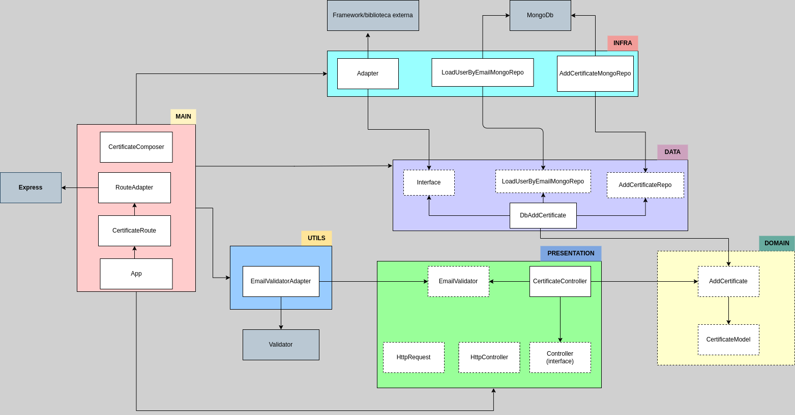

# Engenharia de Software II - Prática ATDD

# Descrição

_API_ em _NodeJs_ utilizando _Typescript, TDD, Clean Architecture, Design Patterns e SOLID principles_

# Objetivos

- Praticar e analisar como a praticar a estratégia de testes na abordagem agile, que preconiza "testes em todo o ciclo de desenvolvimento" desde a User Story até os testes.

- Entender a estratégia de testes: quando, como e o que testar.

- A equipe deverá entender a importância do trabalho do pessoal de Business (Cliente, PO, Designer e Usuários) em parceria com DEVs (Testadores e Desenvolvedores).

# Arquitetura

Para este projeto está sendo utilizado o padrão de arquitetura _Clean Architecture_.

A ideia central da _Clean Architecture_ é criar um sistema altamente testável, flexível e independente de _frameworks_ externos. Ela define uma série de camadas e componentes que separam as responsabilidades e estabelecem uma hierarquia clara de dependências.

Além disso, a _Clean Architecture_ promove fortemente a testabilidade, facilitando a criação de testes unitários e de integração. Como as camadas são altamente independentes, é mais fácil isolar e testar cada componente individualmente.

Em resumo, a _Clean Architecture_ é um padrão arquitetural que visa criar sistemas modulares, testáveis e flexíveis, com foco na separação de preocupações e na manutenção da lógica de negócio central independente de detalhes de implementação. Ela ajuda a garantir a qualidade, a escalabilidade e a longevidade dos projetos de software.



# Execução do projeto

## NPM

- Instale o [Npm](https://www.npmjs.com/);
- Instale o [NodeJs](https://nodejs.org/en/);
- Clone o repositório;
- Acesse a pasta do projeto e execute o comando `npm i` para instalar todas às dependências
- Execute `npm start` para inicializar o server.

---

## DOCKER

- Instale o docker [Docker](https://docs.docker.com/?_gl=1*1i2xyt5*_ga*NDQyNjY0Mjg5LjE2ODUwNTEzNzU.*_ga_XJWPQMJYHQ*MTY4NTA1MTM3NS4xLjEuMTY4NTA1MTM3NS42MC4wLjA.);
- Clone o repositório;
- Execute `docker compose up` para inicializar o server.

---

- Não utilizar yarn neste projeto para evitar conflitos com o npm;

- Antes de subir um commit, execute `npm run pre-commit` para garantir a formatação do projeto;

- Os comandos de script e as dependências do projeto se encontram na pasta `package.json`.

# EXECUÇÃO DOS TESTES

## Testes Automatizados

```bash
npm run test
```

## Testes Automatizados Verboso

```bash
npm run test:verbose
```

## Testes Unitários

```bash
npm run test:unit
```

## Cobertura de Integração

```bash
npm run test:integration
```

## Teste CI

```bash
npm run test:ci
```

## Cobertura de Testes

```
npm run test:coveralls
```

# ENDPOINT

## Descrição

Este endpoint adiciona o certificado para o estudante com o ID correspondente. As informações incluem `id` do certificado, `studentId`, `studentEmail` e `activePlan`.

## URL

http://localhost:5050/api/certificate

## Método

`POST`

## Body

```JSON
{
  "studentId": "validId",
  "studentEmail": "validEmail@gmail.com",
  "activePlan": true
}
```

## Retorno

Status HTTP: 200 OK

```JSON
{
  "id": "validId",
  "studentId": "validId",
  "studentEmail": "validEmail@gmail.com",
  "activePlan": true
}
```
